---
## Author
author:
  name: Учаева Алёна Сергеевна
  degrees: студент НКАбд-03-24
  email: 1132246728@rudn.ru
  affiliation:
    - name: Российский университет дружбы народов
      country: Российская Федерация
      postal-code: 117198
      city: Москва
      address: ул. Миклухо-Маклая, д. 6
## Title
title: Лабораторная работа №2
subtitle: Основы информационной безопасности
license: CC BY
date: today
date-format: "YYYY-MM-DD" # Example: 2025-09-06
---

# Информация

## Докладчик

:::::::::::::: {.columns align=center}
::: {.column width="70%"}

  * Учаева Алёна Сергеевна
  * студент НКАбд-05-24
  * Российский университет дружбы народов им. П. Лумумбы
  * [1132246728@rudn.ru](mailto:1132246728@rudn.ru)

:::
::: {.column width="30%"}

:::
::::::::::::::

# Вводная часть

## Цель работы

Целью данной работы является получение практических навыков работы в консоли с атрибутами файлов, закрепление теоретических основ дискреционного разграничения доступа в современных системах с открытым кодом на базе ОС Linux.

# Выполнение лабораторной работы

## Создание учётной записи пользовтеля guest

В установленной при выполнении предыдущей лабораторной работы операционной системе создаём учётную запись пользователя guest (используя учётную запись администратора): *useradd guest* 

{#fig-001 width=70%}

## Создание учётной записи пользовтеля guest

Зададим пароль для пользователя guest: *passwd guest* 
## Создание учётной записи пользовтеля guest

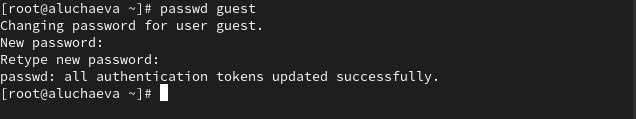{#fig-002 width=70%}

## Создание учётной записи пользовтеля guest

Далее зайдём в систему от имени пользователя guest 

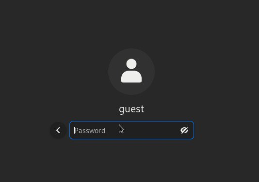{#fig-003 width=70%}

## После входа в систему от имени пользователя guest

Определим директорию, в которой мы находимся, командой *pwd*. Я нахожусь в домашней директории, так как в приглашении командной строки есть *~* 

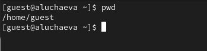{#fig-004 width=70%}

## После входа в систему от имени пользователя guest

Уточним имя нашего пользователя командой *whoami* 

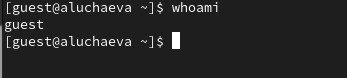{#fig-005 width=70%}

## После входа в систему от имени пользователя guest

Далее уточним имя нашего пользователя, его группу, а также группы, куда входит пользователь, командой *id* 

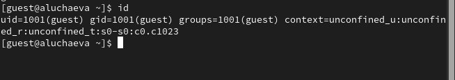{#fig-006 width=70%}  

## После входа в систему от имени пользователя guest

Далее сравним вывод команды *id* с выводом команды *groups*. В выводе команды *groups* информация только о названии группы, к которой относится пользователь. В выводе команды *id* больше
информации: имя пользователя и имя группы, также коды имени пользователя и группы 

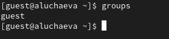{#fig-007 width=70%}

## После входа в систему от имени пользователя guest

Посмотрим файл /etc/passwd командой *cat /etc/passwd & grep guest*, чтобы найти в нём информацию об учётной записи пользователя guest, определить его uid и gid. Найденные значение совпадают с полученными в предыдущих выводах 

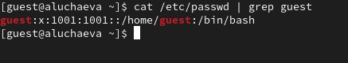{#fig-008 width=70%} 

## После входа в систему от имени пользователя guest

Определим существующие в системе директории командой *ls -l /home/*. Нам удалось получить список поддиректорий директории /home. Права у директорий eavernikovskaya и guest: *drwx------* 

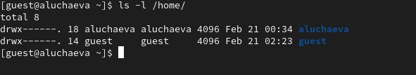{#fig-009 width=70%} 

## После входа в систему от имени пользователя guest

Далее проверим какие расширенные атрибуты установлены на поддиректориях, находящихся в директории /home, командой: *lsattr /home*. Этого увидеть не удалось 

{#fig-010 width=70%}  

## После входа в систему от имени пользователя guest

{#fig-011 width=70%}  

## После входа в систему от имени пользователя guest

Далее создадим в домашней директории поддиректорию dir1 командой *mkdir dir1* 

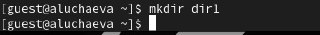{#fig-012 width=70%}  

## После входа в систему от имени пользователя guest

Определим командами *ls -l* и *lsattr*, какие права доступа и расширенные атрибуты были выставлены на директорию dir1 

{#fig-013 width=70%}  

## После входа в систему от имени пользователя guest

{#fig-014 width=70%}  

## После входа в систему от имени пользователя guest

Снимем с директории dir1 все атрибуты командой *chmod 000 dir1* 

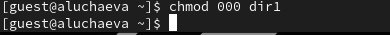{#fig-015 width=70%} 

## После входа в систему от имени пользователя guest 

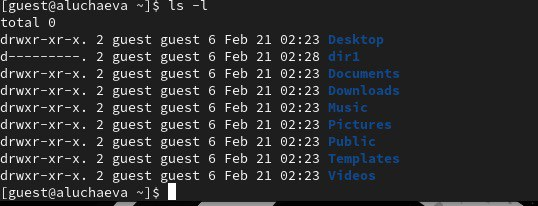{#fig-016 width=70%}  

## После входа в систему от имени пользователя guest

Попытаемся создать в директории dir1 файл file1 командой *echo "test" > /home/guest/dir1/file1*. Мы этго сделать не сможем, так как у директории недостаточно прав для создания файлов 

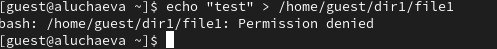{#fig-017 width=70%}

## После входа в систему от имени пользователя guest

Далее проверим командой *ls -l /home/guest/dir1* создался ли файл. Этого мы сделать не сможем, так как у директории всё ещё не достаточно прав даже на просмотр файлов внутри неё. Пэтому изменим атрибуты директории dir1 на 700 и проверим опять, есть ли там файл. Файла там нет!!! 

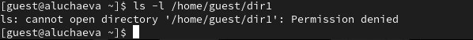{#fig-018 width=70%}

## После входа в систему от имени пользователя guest

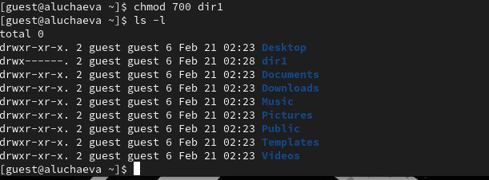{#fig-019 width=70%}

## Заполнение таблиц

Далее я заполнила таблицу 2.1 «Установленные права и разрешённые действия», выполняя действия от имени владельца директории (файлов), определив опытным путём, какие операции разрешены, а какие нет.
Если операция разрешена, я заносила в таблицу знак «+», если не разрешена, знак «-» 

## Заполнение таблиц

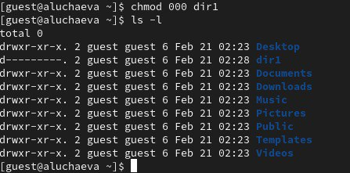{#fig-020 width=70%}

## Заполнение таблиц

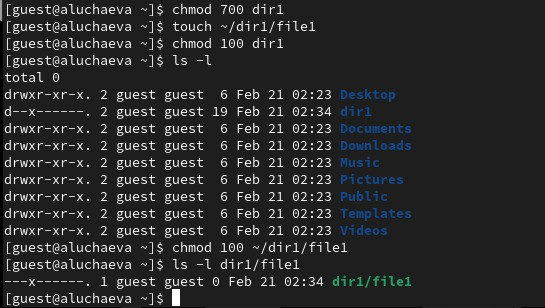{#fig-021 width=70%}

## Заполнение таблиц

{#fig-022 width=70%}

## Заполнение таблиц

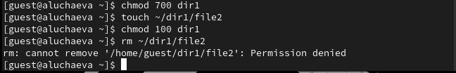{#fig-023 width=70%}

## Заполнение таблиц

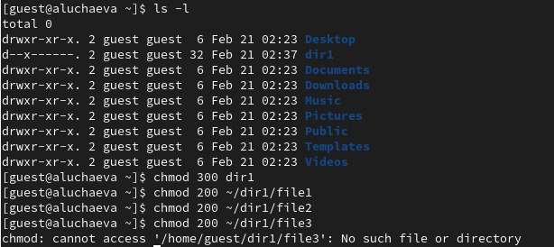{#fig-024 width=70%}

## Заполнение таблиц

Далее на основании заполненной таблицы 2.1 «Установленные права и разрешённые действия» я определила те или иные минимально необходимые права для выполнения операций внутри директории dir1, и заполнила таблицу 2.2 «Минимальные права для совершения операций» 

## Выводы

В ходе выполнения лабораторной работы мы получили практические навыки работы в консоли с атрибутами файлов, закрепили теоретические основы дискреционного разграничения доступа в современных системах с открытым кодом на базе ОС Linux.
