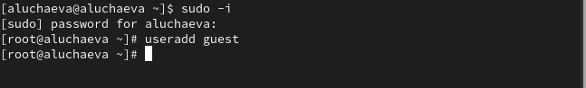
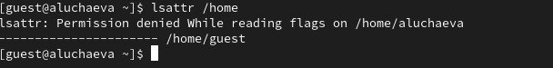
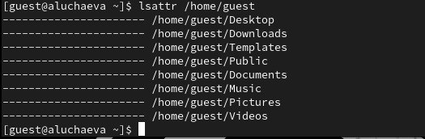
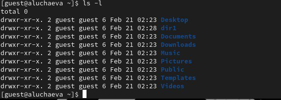
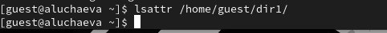
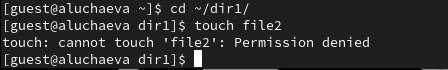

---
## Author
author:
  name: Учаева Алёна Сергеевна
  degrees: студент НКАбд-03-24
  email: 1132246728@rudn.ru
  affiliation:
    - name: Российский университет дружбы народов
      country: Российская Федерация
      postal-code: 117198
      city: Москва
      address: ул. Миклухо-Маклая, д. 6

## Title
title: "Лабораторная работа №2"
subtitle: "Дисциплина: Основы информационной безопасности"
license: "CC BY"
---

# Цель работы

Целью данной работы является получение практических навыков работы в консоли с атрибутами файлов, закрепление теоретических основ дискреционного разграничения доступа в современных системах с открытым кодом на базе ОС Linux.

# Выполнение лабораторной работы

## Создание учётной записи пользовтеля guest

В установленной при выполнении предыдущей лабораторной работы операционной системе создаём учётную запись пользователя guest (используя учётную запись администратора): *useradd guest* ([рис. @fig-001]).

{#fig-001 width=70%}

Зададим пароль для пользователя guest: *passwd guest* (рис. [@fig-002])

{#fig-002 width=70%}

Далее зайдём в систему от имени пользователя guest (рис. [@fig-003])

{#fig-003 width=70%}

## После входа в систему от имени пользователя guest

Определим директорию, в которой мы находимся, командой *pwd*. Я нахожусь в домашней директории, так как в приглашении командной строки есть *~* (рис. [@fig-004])

{#fig-004 width=70%}

Уточним имя нашего пользователя командой *whoami* (рис. [@fig-005])

{#fig-005 width=70%}

Далее уточним имя нашего пользователя, его группу, а также группы, куда входит пользователь, командой *id* (рис. [@fig-006])

{#fig-006 width=70%}  

Далее сравним вывод команды *id* с выводом команды *groups*. В выводе команды *groups* информация только о названии группы, к которой относится пользователь. В выводе команды *id* больше
информации: имя пользователя и имя группы, также коды имени пользователя и группы (рис. [@fig-007])

{#fig-007 width=70%} 

Посмотрим файл /etc/passwd командой *cat /etc/passwd & grep guest*, чтобы найти в нём информацию об учётной записи пользователя guest, определить его uid и gid. Найденные значение совпадают с полученными в предыдущих выводах (рис. [@fig-008])

{#fig-008 width=70%} 

Определим существующие в системе директории командой *ls -l /home/*. Нам удалось получить список поддиректорий директории /home. Права у директорий eavernikovskaya и guest: *drwx------* (рис. [@fig-009])

{#fig-009 width=70%} 

Далее проверим какие расширенные атрибуты установлены на поддиректориях, находящихся в директории /home, командой: *lsattr /home*. Этого увидеть не удалось (рис. [@fig-010]), (рис. [@fig-011])

{#fig-010 width=70%}  

{#fig-011 width=70%}  

Далее создадим в домашней директории поддиректорию dir1 командой *mkdir dir1* (рис. [@fig-012])

{#fig-012 width=70%}  

Определим командами *ls -l* и *lsattr*, какие права доступа и расширенные атрибуты были выставлены на директорию dir1 (рис. [@fig-013]), (рис. [@fig-014])

{#fig-013 width=70%}  

{#fig-014 width=70%}  

Снимем с директории dir1 все атрибуты командой *chmod 000 dir1* (рис. [@fig-015]), (рис. [@fig-016])

{#fig-015 width=70%}  

{#fig-016 width=70%}  

Попытаемся создать в директории dir1 файл file1 командой *echo "test" > /home/guest/dir1/file1*. Мы этго сделать не сможем, так как у директории недостаточно прав для создания файлов (рис. [@fig-017])

{#fig-017 width=70%}

Далее проверим командой *ls -l /home/guest/dir1* создался ли файл. Этого мы сделать не сможем, так как у директории всё ещё не достаточно прав даже на просмотр файлов внутри неё. Пэтому изменим атрибуты директории dir1 на 700 и проверим опять, есть ли там файл. Файла там нет!!! (рис. [@fig-018]), (рис. [@fig-019])

{#fig-018 width=70%}

{#fig-019 width=70%}

## Заполнение таблиц

Далее я заполнила таблицу 2.1 «Установленные права и разрешённые действия», выполняя действия от имени владельца директории (файлов), определив опытным путём, какие операции разрешены, а какие нет.
Если операция разрешена, я заносила в таблицу знак «+», если не разрешена, знак «-» (рис. [-@fig:020]), (рис. [@fig-021]), (рис. [@fig-022]), (рис. [@fig-023]), (рис. [@fig-024])

: Установленные права и разрешённые действия

| | | | | | | | | | |
|-|-|-|-|-|-|-|-|-|-|
|Права директории |Права файла|Создание файла|Удаление файла|Запись в файл|Чтение файла|Смена директории|Просмотр файлов в директории|Переименование файла|Смена атрибутов файла|
|d(000)|(000)|-|-|-|-|-|-|-|-|
|d(000)|(100)|-|-|-|-|-|-|-|-|
|d(000)|(200)|-|-|-|-|-|-|-|-|
|d(000)|(300)|-|-|-|-|-|-|-|-|
|d(000)|(400)|-|-|-|-|-|-|-|-|
|d(000)|(500)|-|-|-|-|-|-|-|-|
|d(000)|(600)|-|-|-|-|-|-|-|-|
|d(000)|(700)|-|-|-|-|-|-|-|-|
|d(100)|(000)|-|-|-|-|-|-|-|+|
|d(100)|(100)|-|-|-|-|-|-|-|+|
|d(100)|(200)|-|-|+|-|-|-|-|+|
|d(100)|(300)|-|-|+|-|-|-|-|+|
|d(100)|(400)|-|-|-|+|-|-|-|+|
|d(100)|(500)|-|-|-|+|-|-|-|+|
|d(100)|(600)|-|-|+|+|-|-|-|+|
|d(100)|(700)|-|-|+|+|-|-|-|+|
|d(200)|(000)|-|-|-|-|-|-|-|-|
|d(200)|(100)|-|-|-|-|-|-|-|-|
|d(200)|(200)|-|-|-|-|-|-|-|-|
|d(200)|(300)|-|-|-|-|-|-|-|-|
|d(200)|(400)|-|-|-|-|-|-|-|-|
|d(200)|(500)|-|-|-|-|-|-|-|-|
|d(200)|(600)|-|-|-|-|-|-|-|-|
|d(200)|(700)|-|-|-|-|-|-|-|-|
|d(300)|(000)|+|+|-|-|+|-|+|+|
|d(300)|(100)|+|+|-|-|+|-|+|+|
|d(300)|(200)|+|+|+|-|+|-|+|+|
|d(300)|(300)|+|+|+|-|+|-|+|+|
|d(300)|(400)|+|+|-|+|+|-|+|+|
|d(300)|(500)|+|+|-|+|+|-|+|+|
|d(300)|(600)|+|+|+|+|+|-|+|+|
|d(300)|(700)|+|+|+|+|+|-|+|+|
|d(400)|(000)|-|-|-|-|-|+|-|-|
|d(400)|(100)|-|-|-|-|-|+|-|-|
|d(400)|(200)|-|-|-|-|-|+|-|-|
|d(400)|(300)|-|-|-|-|-|+|-|-|
|d(400)|(400)|-|-|-|-|-|+|-|-|
|d(400)|(500)|-|-|-|-|-|+|-|-|
|d(400)|(600)|-|-|-|-|-|+|-|-|
|d(400)|(700)|-|-|-|-|-|+|-|-|
|d(500)|(000)|-|-|-|-|-|+|-|+|
|d(500)|(100)|-|-|-|-|-|+|-|+|
|d(500)|(200)|-|-|+|-|-|+|-|+|
|d(500)|(300)|-|-|+|-|-|+|-|+|
|d(500)|(400)|-|-|-|+|-|+|-|+|
|d(500)|(500)|-|-|-|+|-|+|-|+|
|d(500)|(600)|-|-|+|+|-|+|-|+|
|d(500)|(700)|-|-|+|+|-|+|-|+|
|d(600)|(000)|-|-|-|-|-|+|-|-|
|d(600)|(100)|-|-|-|-|-|+|-|-|
|d(600)|(200)|-|-|-|-|-|+|-|-|
|d(600)|(300)|-|-|-|-|-|+|-|-|
|d(600)|(400)|-|-|-|-|-|+|-|-|
|d(600)|(500)|-|-|-|-|-|+|-|-|
|d(600)|(600)|-|-|-|-|-|+|-|-|
|d(600)|(700)|-|-|-|-|-|+|-|-|
|d(700)|(000)|+|+|-|-|+|+|+|+|
|d(700)|(100)|+|+|-|-|+|+|+|+|
|d(700)|(200)|+|+|+|-|+|+|+|+|
|d(700)|(300)|+|+|+|-|+|+|+|+|
|d(700)|(400)|+|+|-|+|+|+|+|+|
|d(700)|(500)|+|+|-|+|+|+|+|+|
|d(700)|(600)|+|+|+|+|+|+|+|+|
|d(700)|(700)|+|+|+|+|+|+|+|+|

{#fig-020 width=70%}

{#fig-021 width=70%}

{#fig-022 width=70%}

{#fig-023 width=70%}

{#fig-024 width=70%}

Далее на основании заполненной таблицы 2.1 «Установленные права и разрешённые действия» я определила те или иные минимально необходимые права для выполнения операций внутри директории dir1, и заполнила таблицу 2.2 «Минимальные права для совершения операций» 

: Минимальные права для совершения операций

| | | | | |
|-|-|-|-|-|
|Операция| |Минимальные  права на  директорию| |Минимальные  права на файл|
|Создание файла| |d(300)| |-|
|Удаление файла| |d(300)| |-|
|Чтение файла| |d(100)| |(400)|
|Запись в файл| |d(100)| |(200)|
|Переименование файла| |d(300)| |(000)|
|Создание поддиректории| |d(300)| |-|
|Удаление поддиректории| |d(300)| |-|

# Выводы

В ходе выполнения лабораторной работы мы получили практические навыки работы в консоли с атрибутами файлов, закрепили теоретические основы дискреционного разграничения доступа в современных системах с открытым кодом на базе ОС Linux.

# Список литературы

1. Лаборатораня работа №2 [Электронный ресурс] URL: https://esystem.rudn.ru/pluginfile.php/3096707/mod_resource/content/6/002-lab_discret_attr.pdf

::: {#refs}
:::
